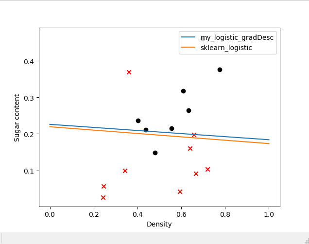
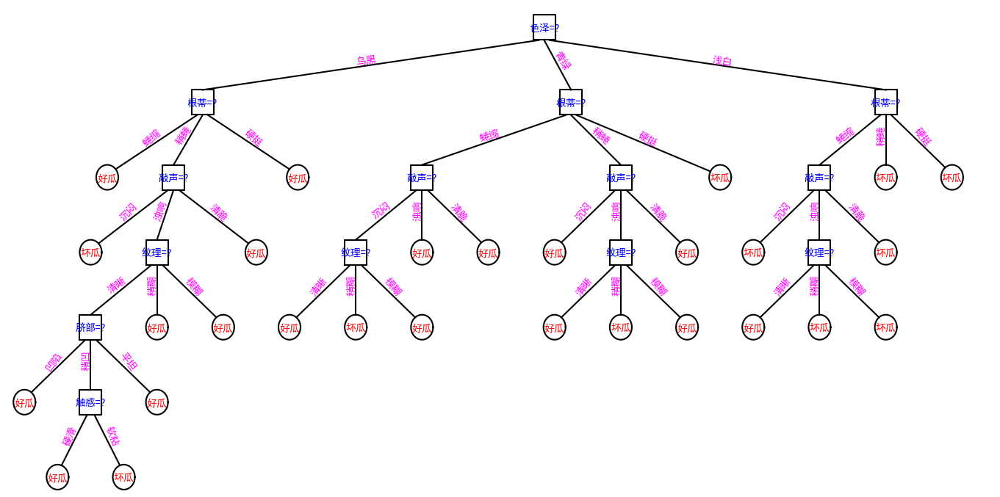
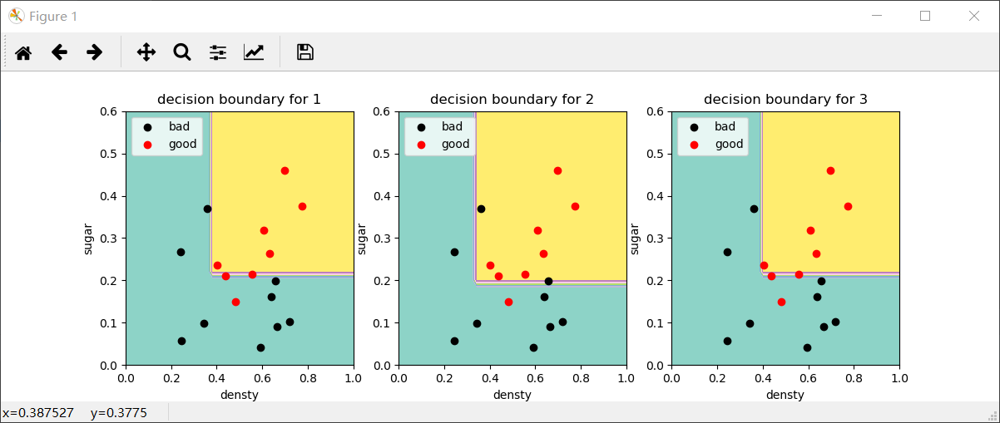

# 《机器学习》实验作业

## 编程环境

- 操作系统：Windows 10
- 开发工具：PyCharm
- 开发语言：Python 3.7
  
## 3.3 编程实现对率回归，并给出西瓜数据集3.0α上的结果

### 数据准备

本题用到的西瓜数据集3.0α如下表：

| 编号 | 密度  | 含糖率 | 好瓜 |
| ---- | ----- | ------ | ---- |
| 1    | 0.697 | 0.46   | 1    |
| 2    | 0.774 | 0.376  | 1    |
| 3    | 0.634 | 0.264  | 1    |
| 4    | 0.608 | 0.318  | 1    |
| 5    | 0.556 | 0.215  | 1    |
| 6    | 0.403 | 0.237  | 1    |
| 7    | 0.481 | 0.149  | 1    |
| 8    | 0.437 | 0.211  | 1    |
| 9    | 0.666 | 0.091  | 0    |
| 10   | 0.243 | 0.0267 | 0    |
| 11   | 0.245 | 0.057  | 0    |
| 12   | 0.343 | 0.099  | 0    |
| 13   | 0.639 | 0.161  | 0    |
| 14   | 0.657 | 0.198  | 0    |
| 15   | 0.36  | 0.37   | 0    |
| 16   | 0.593 | 0.042  | 0    |
| 17   | 0.719 | 0.103  | 0    |

### 对数几率回归—分类学习算法

#### 代码结果



#### 结果分析

由于原数据表数据较少，但这里还是先划分训练集和测试集，基于训练集直接拟合出逻辑回归模型，然后在测试集上评估模型。得出混淆矩阵
$$
\begin{bmatrix}
4 & 1 \\
1 & 3 \\
\end{bmatrix}
$$
和相关度量（查准率（准确率）、查全率（召回率），F1值）结果如下：

|              | precision | recall | f1-score | support |
| ------------ | --------- | ------ | -------- | ------- |
| 0.0          | 0.80      | 0.80   | 0.80     | 5       |
| 1.0          | 0.75      | 0.75   | 0.75     | 4       |
| micro avg    | 0.78      | 0.78   | 0.78     | 9       |
| macro avg    | 0.78      | 0.78   | 0.78     | 9       |
| weighted avg | 0.78      | 0.78   | 0.78     | 9       |

由混淆矩阵可以看到，由于样本本身数量较少，模型拟合效果一般，总体预测精度约为0.78。可以通过扩充数据，进一步的提高精度。

## 4.3 试编程实现基于信息熵进行划分选择的决策树算法，并为表4.2中数据生成一棵决策树。

### 数据准备

- 分析数据：变量包含“色泽”等8个属性，其中6个标称属性，2个连续属性。类标签为“好瓜”或者“坏瓜”（二分类）。具体情况如表1。
- 处理数据：由数据表生成.csv文件。采用pandas.read_csv()读取数据（在这里用到pandas库）。
- 数据可视化：采用seaborn可视化部分数据来进行初步判断。

| 编号 | 色泽 | 根蒂 | 敲声 | 纹理 | 脐部 | 触感 | 密度  | 含糖率 | 好坏 |
| ---- | ---- | ---- | ---- | ---- | ---- | ---- | ----- | ------ | ---- |
| 1    | 青绿 | 蜷缩 | 浊响 | 清晰 | 凹陷 | 硬滑 | 0.697 | 0.46   | 好瓜 |
| 2    | 乌黑 | 蜷缩 | 沉闷 | 清晰 | 凹陷 | 硬滑 | 0.744 | 0.376  | 好瓜 |
| 3    | 乌黑 | 蜷缩 | 浊响 | 清晰 | 凹陷 | 硬滑 | 0.634 | 0.264  | 好瓜 |
| 4    | 青绿 | 蜷缩 | 沉闷 | 清晰 | 凹陷 | 硬滑 | 0.608 | 0.318  | 好瓜 |
| 5    | 浅白 | 蜷缩 | 浊响 | 清晰 | 凹陷 | 硬滑 | 0.556 | 0.215  | 好瓜 |
| 6    | 青绿 | 稍蜷 | 浊响 | 清晰 | 稍凹 | 软粘 | 0.403 | 0.237  | 好瓜 |
| 7    | 乌黑 | 稍蜷 | 浊响 | 稍糊 | 稍凹 | 软粘 | 0.481 | 0.149  | 好瓜 |
| 8    | 乌黑 | 稍蜷 | 浊响 | 清晰 | 稍凹 | 硬滑 | 0.437 | 0.211  | 好瓜 |
| 9    | 乌黑 | 稍蜷 | 沉闷 | 稍糊 | 稍凹 | 硬滑 | 0.666 | 0.091  | 坏瓜 |
| 10   | 青绿 | 硬挺 | 清脆 | 清晰 | 平坦 | 软粘 | 0.243 | 0.267  | 坏瓜 |
| 11   | 浅白 | 硬挺 | 清脆 | 模糊 | 平坦 | 硬滑 | 0.245 | 0.057  | 坏瓜 |
| 12   | 浅白 | 蜷缩 | 浊响 | 模糊 | 平坦 | 软粘 | 0.343 | 0.099  | 坏瓜 |
| 13   | 青绿 | 稍蜷 | 浊响 | 稍糊 | 凹陷 | 硬滑 | 0.639 | 0.161  | 坏瓜 |
| 14   | 浅白 | 稍蜷 | 沉闷 | 稍糊 | 凹陷 | 硬滑 | 0.657 | 0.198  | 坏瓜 |
| 15   | 乌黑 | 稍蜷 | 浊响 | 清晰 | 稍凹 | 软粘 | 0.36  | 0.37   | 坏瓜 |
| 16   | 浅白 | 蜷缩 | 浊响 | 模糊 | 平坦 | 硬滑 | 0.593 | 0.042  | 坏瓜 |
| 17   | 青绿 | 蜷缩 | 沉闷 | 稍糊 | 稍凹 | 硬滑 | 0.719 | 0.103  | 坏瓜 |

### 决策树算法

#### 算法思想

基于树结构进行决策：

- 每个“内部结点”对应于某个属性上的“测试”(test)
- 每个分支对应于该测试的一种可能结果（即该属性的某个取值）
- 每个“叶结点”对应于一个“预测结果”

主要包含两个过程：

1. 学习过程：通过对训练样本的分析来确定“划分属性”
2. 预测过程：将测试示例从根结点开始，沿着划分属性所构成的“判定测试序列”下行，直到叶结点

#### 实现思路

- 基本流程：自根至叶的递归过程，在每个中间结点寻找一个“划分”属性。

- 处理策略：
  1. 对于树形结构，可以创建节点类来进行操作，根据书p74决策树基本算法，广泛采用递归操作；
  2. 对于连续属性（密度、含糖率），对其进行离散化（可采用二分法）；
  3. 对于标称属性（色泽、纹理等），考虑Python字典，方便操作其特征类别（如：‘色泽’：‘青绿’，‘乌黑’，‘浅白’）；
   
- 停止条件：
  1. 当前结点包含的样本全属于同一类别，无需划分;
  2. 当前属性集为空, 或是所有样本在所有属性上取值相同，无法划分;
  3. 当前结点包含的样本集合为空，不能划分.

#### 代码结果



#### 结果分析

对与西瓜数据集3.0数据新型分析，通过信息熵进行决策，生成了上图的决策树。

## 5.5 试编程实现标准BP算法和累积BP算法，在西瓜数据集3.0上分别用这两个算法训练一个单隐层网络，并进行比较。

### 数据准备

| 编号 | 色泽 | 根蒂 | 敲声 | 纹理 | 脐部 | 触感 | 密度  | 含糖率 | 好坏 |
| ---- | ---- | ---- | ---- | ---- | ---- | ---- | ----- | ------ | ---- |
| 1    | 青绿 | 蜷缩 | 浊响 | 清晰 | 凹陷 | 硬滑 | 0.697 | 0.46   | 好瓜 |
| 2    | 乌黑 | 蜷缩 | 沉闷 | 清晰 | 凹陷 | 硬滑 | 0.744 | 0.376  | 好瓜 |
| 3    | 乌黑 | 蜷缩 | 浊响 | 清晰 | 凹陷 | 硬滑 | 0.634 | 0.264  | 好瓜 |
| 4    | 青绿 | 蜷缩 | 沉闷 | 清晰 | 凹陷 | 硬滑 | 0.608 | 0.318  | 好瓜 |
| 5    | 浅白 | 蜷缩 | 浊响 | 清晰 | 凹陷 | 硬滑 | 0.556 | 0.215  | 好瓜 |
| 6    | 青绿 | 稍蜷 | 浊响 | 清晰 | 稍凹 | 软粘 | 0.403 | 0.237  | 好瓜 |
| 7    | 乌黑 | 稍蜷 | 浊响 | 稍糊 | 稍凹 | 软粘 | 0.481 | 0.149  | 好瓜 |
| 8    | 乌黑 | 稍蜷 | 浊响 | 清晰 | 稍凹 | 硬滑 | 0.437 | 0.211  | 好瓜 |
| 9    | 乌黑 | 稍蜷 | 沉闷 | 稍糊 | 稍凹 | 硬滑 | 0.666 | 0.091  | 坏瓜 |
| 10   | 青绿 | 硬挺 | 清脆 | 清晰 | 平坦 | 软粘 | 0.243 | 0.267  | 坏瓜 |
| 11   | 浅白 | 硬挺 | 清脆 | 模糊 | 平坦 | 硬滑 | 0.245 | 0.057  | 坏瓜 |
| 12   | 浅白 | 蜷缩 | 浊响 | 模糊 | 平坦 | 软粘 | 0.343 | 0.099  | 坏瓜 |
| 13   | 青绿 | 稍蜷 | 浊响 | 稍糊 | 凹陷 | 硬滑 | 0.639 | 0.161  | 坏瓜 |
| 14   | 浅白 | 稍蜷 | 沉闷 | 稍糊 | 凹陷 | 硬滑 | 0.657 | 0.198  | 坏瓜 |
| 15   | 乌黑 | 稍蜷 | 浊响 | 清晰 | 稍凹 | 软粘 | 0.36  | 0.37   | 坏瓜 |
| 16   | 浅白 | 蜷缩 | 浊响 | 模糊 | 平坦 | 硬滑 | 0.593 | 0.042  | 坏瓜 |
| 17   | 青绿 | 蜷缩 | 沉闷 | 稍糊 | 稍凹 | 硬滑 | 0.719 | 0.103  | 坏瓜 |

### 算法思想

#### 标准BP算法

输入： 训练集 D，学习率 η.

过程：

1. 随即初始化连接权与阈值 (ω，θ). 
2. Repeat：
3. for x_k，y_k in D:
4. 根据当前参数计算出样本误差 E_k.
5. 根据公式计算出随机梯度项 g_k.
6. 根据公式更新 (ω，θ).
7. end for
8. until 达到停止条件

输出：(ω，θ) - 即相应的多层前馈神经网络.

#### 累积BP算法

输入： 训练集 D，学习率 η，迭代次数 n.

过程： 

1. 随即初始化连接权与阈值 (ω，θ).
2. Repeat：
3. 根据当前参数计算出累积误差 E.
4. 根据公式计算出标准梯度项 g.
5. 根据公式更新 (ω，θ).
6. n = n-1
7. until n=0 or 达到停止条件

输出：(ω，θ) - 即相应的多层前馈神经网络.

#### 两种算法的区别

标准BP算法每次针对单个训练样例更新权值与阈值，参数更新频繁, 不同样例可能抵消, 需要多次迭代；累积BP算法其优化目标是最小化整个训练集上的累计误差读取整个训练集一遍才对参数进行更新, 参数更新频率较低。在很多任务中, 累计误差下降到一定程度后, 进一步下降会非常缓慢, 这时标准BP算法往往会获得较好的解, 尤其当训练集非常大时效果更明显。

### 结果分析

通过本次实验，对书本公式和算法进行了推导，利用书本所给数据集进行尝试，深入理解了神经网络。
在本例下，要达到某一限定的均方误差时，标准BP比累积BP收敛得更快，将ABP算法误差设定到0.01时，其更新权重次数十分庞大。虽然ABP可能收敛更慢，但是其分类精度比同等条件下的BP算法要高。

## 6.3 选择两个UCI数据集，分别用线性核和高斯核训练一个SVM，并与BP神经网络和C4.5决策树进行实验比较。

### 数据准备

这里我们选择UCI数据集 Breast Cancer Data Set 进行分类实验，该数据集已经集成在sklearn中，可以直接采用sklearn.datasets.load_breast_cancer获取。

数据的关键类别如下：

1. 类别：'malignant(恶性)' 'benign(良性)'，共两类；
2. 样本规模：[n_sample,n_feature] = [569, 30]；
3. 正负样本数：212(M),357(B)；
4. 特征数值特性：实数，正值；

加载数据，选择前两个特征可视化出散点图如如图1所示，并且由图1我们可以知道绿色为良性(肿瘤)，红色对应恶性，于是可直观看出，体积越大恶性概率越高。经过预分析，我认为该数据集可以直接用于SVM，BP神经网络和C4.5的模型学习。


### 代码结果

max accuracy of linear kernel SVM: 0.937  
max accuracy of rbf kernel SVM: 0.933

.png)

.png)

.png)


### 结果分析

线性核SVM的最大准确率为:0.937；高斯核SVM的最大准确率为:0.933。由BP神经网络的实现结果可得训练次数:1001以及错误率为: 6.69%。C4.5决策树的准确度为: 0.909。

3种模型对比

- 资源消耗：BP神经网络训练消耗计算机资源最大，SVM也比较耗资源，C4.5决策树消耗资源最小，训练速度极快。
- 参数调节：BP网络的精度受模型结构和参数的设定影响较大，需要耐心的调参。不同核函数下的SVM精度与数据对象特性息息相关，实践中也是结合参数（如惩罚系数）要不断调试的，决策树-C4.5算法则相对固定一些。
- 模型精度：只要模型与参数设置得当，经过足够的训练甚至交叉验证等，三种模型均可表现出不错的精度。

## 7.3 试编程实现拉普拉斯修正的朴素贝叶斯分类器，并以西瓜数据集3.0为训练集，对p.151“测1”进行判别。

### 数据准备

| 编号 | 色泽 | 根蒂 | 敲声 | 纹理 | 脐部 | 触感 | 密度  | 含糖率 | 好瓜 |
| ---- | ---- | ---- | ---- | ---- | ---- | ---- | ----- | ------ | ---- |
| 1    | 青绿 | 蜷缩 | 浊响 | 清晰 | 凹陷 | 硬滑 | 0.697 | 0.46   | 是   |
| 2    | 乌黑 | 蜷缩 | 沉闷 | 清晰 | 凹陷 | 硬滑 | 0.774 | 0.376  | 是   |
| 3    | 乌黑 | 蜷缩 | 浊响 | 清晰 | 凹陷 | 硬滑 | 0.634 | 0.264  | 是   |
| 4    | 青绿 | 蜷缩 | 沉闷 | 清晰 | 凹陷 | 硬滑 | 0.608 | 0.318  | 是   |
| 5    | 浅白 | 蜷缩 | 浊响 | 清晰 | 凹陷 | 硬滑 | 0.556 | 0.215  | 是   |
| 6    | 青绿 | 稍蜷 | 浊响 | 清晰 | 稍凹 | 软粘 | 0.403 | 0.237  | 是   |
| 7    | 乌黑 | 稍蜷 | 浊响 | 稍糊 | 稍凹 | 软粘 | 0.481 | 0.149  | 是   |
| 8    | 乌黑 | 稍蜷 | 浊响 | 清晰 | 稍凹 | 硬滑 | 0.437 | 0.211  | 是   |
| 9    | 乌黑 | 稍蜷 | 沉闷 | 稍糊 | 稍凹 | 硬滑 | 0.666 | 0.091  | 否   |
| 10   | 青绿 | 硬挺 | 清脆 | 清晰 | 平坦 | 软粘 | 0.243 | 0.267  | 否   |
| 11   | 浅白 | 硬挺 | 清脆 | 模糊 | 平坦 | 硬滑 | 0.245 | 0.057  | 否   |
| 12   | 浅白 | 蜷缩 | 浊响 | 模糊 | 平坦 | 软粘 | 0.343 | 0.099  | 否   |
| 13   | 青绿 | 稍蜷 | 浊响 | 稍糊 | 凹陷 | 硬滑 | 0.639 | 0.161  | 否   |
| 14   | 浅白 | 稍蜷 | 沉闷 | 稍糊 | 凹陷 | 硬滑 | 0.657 | 0.198  | 否   |
| 15   | 乌黑 | 稍蜷 | 浊响 | 清晰 | 稍凹 | 软粘 | 0.36  | 0.37   | 否   |
| 16   | 浅白 | 蜷缩 | 浊响 | 模糊 | 平坦 | 硬滑 | 0.593 | 0.042  | 否   |
| 17   | 青绿 | 蜷缩 | 沉闷 | 稍糊 | 稍凹 | 硬滑 | 0.719 | 0.103  | 否   |

### 代码结果

```
p.151例1的结果：
好瓜
```

### 结果分析

书上求得的标准差是除以（N-1）即np.std(x, ddof=1)得到的，用与numpy直接用std计算结果存在偏差。当输入书上p.151上的样例：具有青绿', '蜷缩', '浊响', '清晰', '凹陷', '硬滑'特征的瓜，密度为0.697和含糖率为0.460时，判断的结果为好瓜，与书上结果一致。

## 8.3 试编程实现Bagging，以决策树桩为基学习器，在西瓜数据集3.0a上训练一个Bagging集成，并与图8.6进行比较。

### 代码结果



### 结果分析
Bagging采用决策树桩，设置决策树最大深度为1，无论集成学习器数量多少，最终错误率仍然很高，而当决策树最大深度为2时（图2），总体上基学习器的数量越多，分类错误率越低，这与书中图8.6的情况基本一致。


## 9.4 试编程实现k均值算法，设置三组不同的k值，三组不同初始中心点，在西瓜数据集4.0上进行实验比较，并讨论什么样的初始中心有利于取得好结果。

### 代码结果

.png)

.png)

.png)

.png)

### 结果分析

k值的选择是指定的，不同的k得到的结果会有挺大的不同，如上图所示，k较小的时候，显示不同的簇比较稀疏。由上述图我们可以看到K-means是一种凸聚类算法，即每个类的凸包不会包含其他类的点。K-means算法是一种局部最优的最小化类间最小化均方误差的算法，初始随机的中心不同会导致算法的迭代次数与最终结果有很大的不同。一般来说，初始的中心越集中且越靠近边缘，则会使得迭代次数更多。初始中心越分散，结果越好。